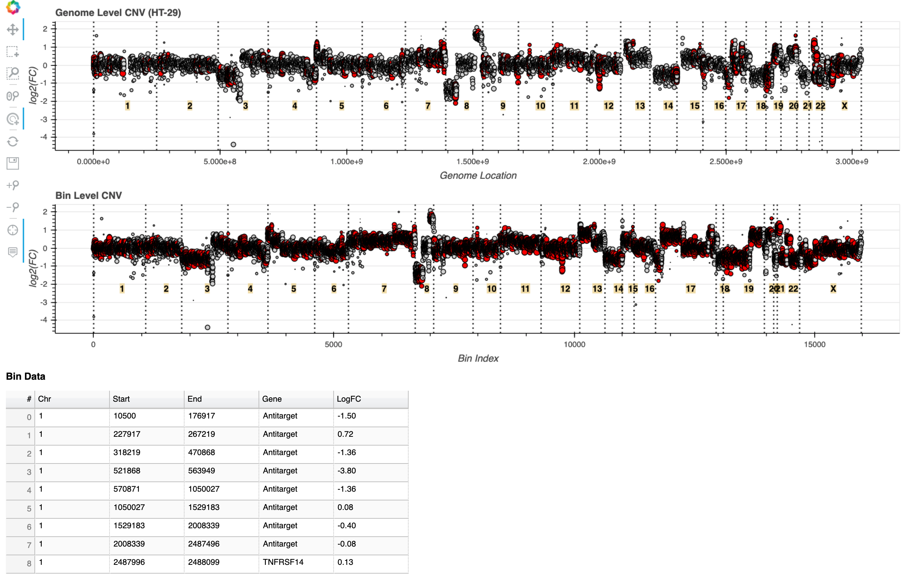
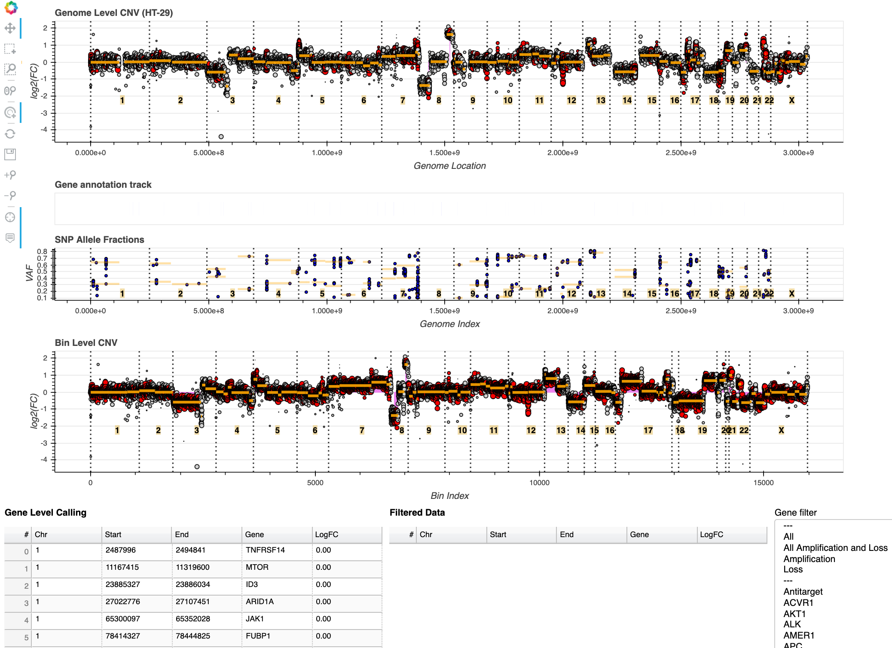
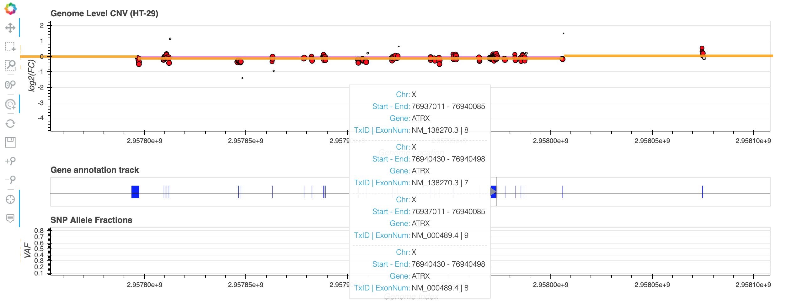
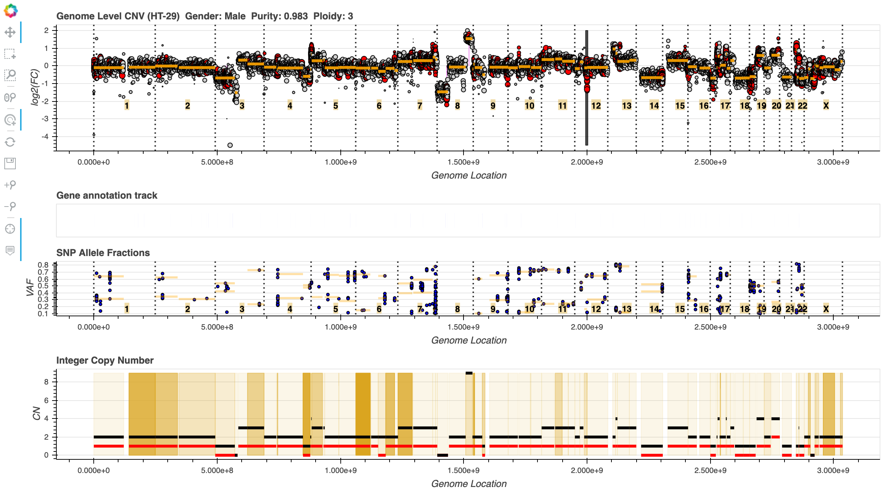
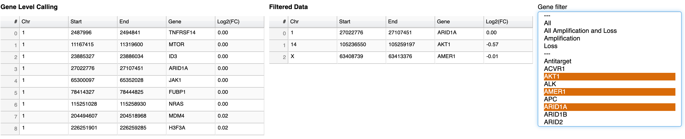

[](https://www.gnu.org/licenses/gpl-3.0)     [](https://travis-ci.com/rghu/reconCNV)     [](https://codecov.io/gh/rghu/reconCNV)
# reconCNV

Performing copy number analysis from targeted capture high-throughput sequencing has been a challenging task. This involves binning the targeted region, calculating the log ratio of the read depths between the sample and the reference, and then stitching together thousands of these data points into numerous segments (especially in the context of cancer) to derive the copy number state of genomic regions. Recently, several tools have been developed to adequately detect both somatic as well as germline CNVs. However, review and interpretation of these variants in a clinical as well as research setting is a daunting task. This can involve frequent switches back and forth from a static image to numerous tabular files resulting in an exasperated reviewer.  
 ReconCNV has been developed to overcome this challenge by providing interactive dashboard for hunting copy number variations (CNVs) from high-throughput sequencing data. The tool has been tested for targeted gene panels (including exome data). Python3's powerful visualization and data manipulation modules, namely Bokeh and Pandas, are utilized to create these dynamic visualizations. ReconCNV can be readily applied to most CNV calling algorithms with simple modifications to the configuration file. 


## Installation

The easiest way to get started with reconCNV is via `conda`. Using `conda` ensures you are running Python 3.6 (using which reconCNV was coded) and all dependencies are installed within an virtual environment. This avoids dependency conflicts with existing programs. If `conda` is not available on your system, a minimal installer can be installed using [Miniconda](https://docs.conda.io/en/latest/miniconda.html).

1. Clone the reconCNV repository
    ```
    git clone https://github.com/rghu/reconCNV.git
    ```
    
    To use the [Docker container](https://hub.docker.com/repository/docker/raghuc1990/reconcnv) see instructions under Usage ...
    
2. Create your virtual environment. In the below example we are creating a virtual environment called "reconCNV".
    ```
    conda create -n reconCNV python=3.6
    ```
3. Activate your virtual environment.
    ```
    conda activate reconCNV
    ```
4. Install all python module dependencies
    ```
    pip install --user --requirement requirements.txt
    ```
5. You are now ready to use reconCNV!
6. Once you are done using the virtual environment you can exit it.
    ```
    source deactivate reconCNV
    ```
    
## Usage


```
usage: reconCNV.py [-h] --ratio-file RATIO_FILE --genome-file GENOME_FILE
                   --config-file CONFIG_FILE --out-dir OUT_DIR --out-file
                   OUT_FILE [--seg-file SEG_FILE] [--gene-file GENE_FILE]
                   [--seg-blacklist SEG_BLACKLIST]
                   [--annotation-file ANNOT_FILE] [--vcf-file VCF_FILE]
                   [--recenter RECENTER] [--vcf-filt-file]
                   [--vcf-blacklist BED_BLACKLIST] [--purity PURITY]
                   [--ploidy PLOIDY] [--gender GENDER] [--verbose] [--version]

Visualize CNV data from short read sequencing data.

optional arguments:
  -h, --help            show this help message and exit
  --ratio-file RATIO_FILE, -r RATIO_FILE
                        File which contains the log2(FC) of bins between the
                        tumor sample and another normal sample. [Required]
  --genome-file GENOME_FILE, -x GENOME_FILE
                        File which contains chromosome length and cumulative
                        genomic length. [Required]
  --config-file CONFIG_FILE, -c CONFIG_FILE
                        File which contains plot options and column name
                        customizations. [Required]
  --out-dir OUT_DIR, -d OUT_DIR
                        Directory to place output files. [Required]
  --out-file OUT_FILE, -o OUT_FILE
                        Output file name (file will be placed in output dir -
                        enter only filename). [Required]
  --seg-file SEG_FILE, -s SEG_FILE
                        File which contains the segmentation of log2(FC) bin
                        values between the tumor sample and normal sample.
  --gene-file GENE_FILE, -g GENE_FILE
                        File which contains gene calling information.
  --seg-blacklist SEG_BLACKLIST, -t SEG_BLACKLIST
                        BED file of problematic copy number regions to
                        highlight.
  --annotation-file ANNOT_FILE, -a ANNOT_FILE
                        File which contains gene/exon information.
  --vcf-file VCF_FILE, -v VCF_FILE
                        VCF containing variants to plot VAF.
  --recenter RECENTER, -y RECENTER
                        Recenter to provided log2(FC).
  --vcf-filt-file, -f   Flag to output filtered variants used for plotting
                        VAFs. (applicable only if providing VCF)
  --vcf-blacklist BED_BLACKLIST, -b BED_BLACKLIST
                        File containing variants to NOT plot VAF. (applicable
                        only if providing VCF)
  --purity PURITY, -p PURITY
                        Purity of the sample.
  --ploidy PLOIDY, -l PLOIDY
                        Ploidy of the sample.
  --gender GENDER, -z GENDER
                        Ploidy of the sample.
  --verbose, -j         Verbose logging output
  --version             show program's version number and exit
```

reconCNV has been tested on MacOS and Linux environments.


reconCNV is also available via Docker by executing the following commands:

1. Docker pull command

    ```
    docker pull raghuc1990/reconcnv
    ```

2. Append the following command before providing reconCNV command line options
    
    ```
    docker run --rm -it -v <directory_to_mount>:/opt/reconCNV/ raghuc1990/reconcnv:latest \ 
                        <reconCNV_options>
    ```
    
    Example:
    ```
    docker run --rm -it -v `pwd`:/opt/reconCNV/ raghuc1990/reconcnv:latest \ 
                        -r data/sample_data/HT-29.cnr \
                        -x data/hg19_genome_length.txt \
                        -d .  -o HT-29.html \
                        -c config.json
    ```


## Quickstart with an example

At the minimum we need the ratio file and genome file to generate a plot using reconCNV. First make sure values of keys within the "column_names" field in the JSON configuration file matches those seen on the header of ratio and genome files. 

```
 python3 reconCNV.py -r <ratio_file> \
                     -x <genome_file> \
                     -d <output_directory> \
                     -o <output_file> \
                     -c <config_file>
```
 
In this example we will use copy number analysis performed using [CNVkit](https://github.com/etal/cnvkit). Illumina sequencing for the HT-29 colon cancer cell line was performed using a 124 gene hybridization-based capture panel. `data/sample_data` directory contains the input files required for this example. See Input section below for details.
 
 _ratio file_: `data/sample_data/HT-29.cnr` - contains coordinates and log2(FC) of bins.  
 _segmentation file_: `data/sample_data/HT-29.cns` - contains coordinates and log2(FC) of copy number segments.  
 _gene file_: `data/sample_data/HT-29.genemetrics.cns` - contains coordinates and gene-level CNV log2(FC).    
 _VCF file_: `data/sample_data/HT-29.vcf` - contains information on genotyped SNP loci.  
 _annotation file_: `data/hg19_COSMIC_genes_model.txt`  
 _genome file_: `data/hg19_genome_length.txt` - contains chromosome length and cumulative genomic length of chromosomes  
 
 Create output "results" directory  
 
 ```
 mkdir results
 ``` 
 
 Run the command below to generate a HTML file with the visualization that can be opened on any modern web browser preferably Google Chrome.
 
 ```
 python3 reconCNV.py -r data/sample_data/HT-29.cnr \
                     -x data/hg19_genome_length.txt \
                     -d results/ -o HT-29.html \
                     -c config.json
 ```
 
 In this example we have generated two plots representing the CNV data for HT-29 cell line using genome coordinates as well as bin indices (sequential lineup of bins). Various tools (top left corner in the image below) can be used to interact with the data.
 
  
 
**Tools**  
 _Pan_: used for dragging the plot.  
 _Box Select_: used to perform a rectangular selection on the x-axis highlighting a genomic region. The selection simultaneously occurs on the "Bin Data" table as well.  
 _Box Zoom_: used to perform a rectangular zoom to a region of the plot.  
 _Wheel Zoom_: used to zoom in and out based on the current location of the mouse in the x-axis.  
 _Tap Tool_: click on any plot feature to open UCSC genome browser with those genome coordinates.  
 _Reset Plot_: return the plot to its original view.  
 _Save View_: export a PNG file of the current view.  
 _Zoom In_: zoom in by clicking the tool to the center of the plot.  
 _Zoom Out_: zoom out by clicking the tool to the center of the plot.  
 _Crosshair_: enable/disable display of crosshairs.  
 _Hover_: enable/disable display of annotation when hovering over plot features.  
 
 

 
 
 Now provide the segmentation file `data/sample_data/HT-29.cns` to annotate the copy number segments to the output HTML file.
 
 ```
 python3 reconCNV.py -r data/sample_data/HT-29.cnr \
                     -x data/hg19_genome_length.txt \
                     -d results/ \
                     -o HT-29.html \
                     -c config.json \
                     -s data/sample_data/HT-29.cns
 ```
 
 Next, when we provide the gene file `data/sample_data/HT-29.genemetrics.cns` to reconCNV we get a feature to select genes of interest for subsetting/filtering using a multiselect box. The user can also select multiple genes of interest to filter for by holding the cntrl (Windows/Linux) or cmd (Mac) and selecting the gene names from the list. It also has quick selections such as filtering only amplifications and losses or simply just losses or amplifications satisfying the log2(FC) threshold set in the configuration file.    
  
 ```
 python3 reconCNV.py -r data/sample_data/HT-29.cnr \
                     -x data/hg19_genome_length.txt \
                     -d results/ \
                     -o HT-29.html \
                     -c config.json \
                     -s data/sample_data/HT-29.cns \
                     -g data/sample_data/HT-29.genemetrics.cns
 ```
 
 We can also plot the SNP frequencies by providing reconCNV a VCF file. This feature was designed to retrieve potential heterozygous SNP sites from a tumor only analysis by genotyping polymorphic sites. Thresholds for identifying robust SNP loci can be modified in the configuration file (for more details see _Input_ section).
 
  ```
 python3 reconCNV.py -r data/sample_data/HT-29.cnr \
                     -x data/hg19_genome_length.txt \
                     -d results/ \
                     -o HT-29.html \
                     -c config.json \
                     -s data/sample_data/HT-29.cns \
                     -g data/sample_data/HT-29.genemetrics.cns \
                     -v data/sample_data/HT-29.vcf
 ```
 
 We can also add an annotation track to reconCNV. In this case we are adding exon level annotation for all RefSeq transcripts of COSMIC genes. Note: Annotations appear once log2(FC) genome plots are zoomed in to a gene under investigation.
 
 ```
 python3 reconCNV.py -r data/sample_data/HT-29.cnr \
                     -x data/hg19_genome_length.txt \
                     -d results/ \
                     -o HT-29.html \
                     -c config.json \
                     -s data/sample_data/HT-29.cns \
                     -g data/sample_data/HT-29.genemetrics.cns \
                     -v data/sample_data/HT-29.vcf \
                     -a data/hg19_COSMIC_genes_model.txt
 ```
 
 
 
## Input

**Configuration file**  
Written in a JSON format, this file allows the user to customize reconCNV according to the user's input files and plotting preferences. This nested document contains two main keys, "files" and "plots", within which parameter and threshold customizations are listed. "files" key should be used primarily for referencing the column names of input files.  "plots" key is also further nested to include visualization options for different plots produced by reconCNV. Fields used in the configuration are further explained below. An example config file with values is provided for using as a template.

_**All fields in the config file are mandataory and `column_names` must be unique!**_ If 'gene' and 'weight' fields/columns are not present in your input files, keep the default column names as seen in the example configuration file and reconCNV will automatically add pseudo values for these fields/columns. 

Refer to an example configuration file `config.json`.

**Ratio file**  
Ratio file contains the chromosome coordinates and the log2 fold change data points (bins) to be plotted. This tab delimited file must have headers describing the following:

_chromosome_: column with the chromosome name of the bin.  
_start_: column with the starting chromosome coordinates of the bin.  
_end_: column with the ending chromosome coordinates of the bin.  
_gene_: column with annotation of the bin. Specify gene name associated with the bin or any associated annotation.  
_log2FC_: column with the log2 fold change value of the bin.
_weight_: column that indicates the confidence of the bin (used to plot the size of points representing the bin). 

Ratio file can have any number of columns in addition to those described above. Column names in your ratio file representing these fields can be entered in the configuration file under `files -> ratio_file -> column_names`  

```  
"files":{
		"ratio_file":{
			"column_names":{
				"chromosome": <string>,
				"start": <string>,
				"end": <string>,
				"gene": <string>,
				"log2FC": <string>,
				"weight": <string>
			},
			"field_separator": "\t",
			"off_target_label": <string>,
			"off_target_low_conf_log2": <number>,
			"weight_scaling_factor": <number>
		}
```
`files -> ratio_file -> field_separator`: delimited to use.   
`files -> ratio_file -> off_target_label`: in case you are using off-target reads in your analysis use this field to specify your annotation label for them. This is the term used to describe these bins in your ratio file under the "gene" column.  
`files -> ratio_file -> off_target_low_conf_log2`: using off-target reads can sometimes result in low confidence off-target bins with very low log2(FC) values that do not need to be plotted. Use this field to set a threshold of log2(FC) below which off-target bins will not be plotted.  
`files -> ratio_file -> weight_scaling_factor`: used for adjusting values in the "weight" column (multiplies the value in the "weight" column with this number).

Refer to an example ratio file `data/sample_data/HT-29.cnr`.

**Genome file**  
Genome file contain chromosomal length information for the genome build used to perform CNV analysis. This tab delimited file must have headers describing the following:

_chromosome_: column with the chromosome name  
_length_: column with the length of the chromosome  
_cumulative length_: column with the cumulative chromosome length to order the chromosomes  

_**Make sure all your input files are using the same genome build!**_

Genome file can have any number of columns in addition to those described above. Column names in your genome file representing these fields can be entered in the configuration file under `files -> genome_file -> column_names`.  

```
{
	"files":{
		"genome_file":{
			"column_names":{
				"chromosome": <string>,
				"chr_length": <string>,
				"chr_cumulative_length": <string>
			},
			"field_separator": "\t"
		}
```
`files -> genome_file -> field_separator`: delimited to use.   

Users can create a genome file by parsing the index file generated by `samtools faidx` command and adding the corresponding header (chromosome, length, cumulative_length).
```
samtools faidx <genome>.fa # this generates <genome>.fa.fai - index file
cut -f 1,2 <genome>.fa.fai | awk 'BEGIN{CUMSUM=0}{print $0"\t"CUMSUM; CUMSUM = CUMSUM + $2}'
```

Refer to an example genome file `data/hg19_genome_length.txt`.

**Segmentation file**  
Segmentation file contains information on the copy number segments. This tab delimited file must have headers describing the following:

_chromosome_: column with the chromosome name of the segment.  
_start_: column with the starting chromosome coordinates of the segment.  
_end_: column with the ending chromosome coordinates of the segment.  
_gene_: column with annotation of the segment. Ex. genes associated with the segment.   
_log2FC_: column with the log2 fold change value of the segment. 
_major_cn_: column with the major/total integer copy number of the segment.
_minor_cn_: column with the minor integer copy number of the segment.
_cell_frac_: column with the cell fraction of the segment.

Segmentation file can have any number of columns in addition to those described above. Column names in your segmentation file representing these fields can be entered in the configuration file under `files -> segmentation_file -> column_names`.  

```
"files":{
		"segmentation_file":{
			"column_names":{
				"chromosome": <string>,
				"start": <string>,
				"end": <string>,
				"log2FC": <string>,
				"gene": <string>,
				"major_cn": "mcn",
				"minor_cn": "lcn",
				"cell_frac": "cf"
			},
			"field_separator": "\t"
		}
```
`files -> segmentation_file -> field_separator`: delimited to use.   

Refer to an example segmentation file `data/sample_data/HT-29.cns`.

**Gene file**  
Gene file contains information on the gene-level copy number values. This tab delimited file must have headers describing the following:

_chromosome_: column with the chromosome name of the gene.  
_start_: column with the starting chromosome coordinates of the gene in a particular segment.  
_end_: column with the ending chromosome coordinates of the gene in a particular segment.  
_gene_: column with gene name.   
_log2FC_: column with the log2 fold change value of the gene in a particular segment. 

Gene file can have any number of columns in addition to those described above. Column names in your gene file representing these fields can be entered in the configuration file under `files -> gene_file -> column_names`.  

```
"files":{
		"gene_file":{
			"column_names":{
				"chromosome": <string>,
				"start": <string>,
				"end": <string>,
				"gene": <string>,
				"log2FC": <string>
			},
            "field_separator": "\t",
			"loss_threshold": -0.4,
			"deep_loss_threshold": -1.0,
			"gain_threshold" : 0.5,
			"amp_threshold": 1.5
		}
```

`files -> gene_file -> field_separator`: delimited to use.   
`files -> gene_file -> loss_threshold`: log2 fold change threshold used to mark gene-level losses.  
`files -> gene_file -> deep_loss_threshold`: log2 fold change threshold used to mark deep gene-level losses.  
`files -> gene_file -> gain_threshold`: log2 fold change threshold used to mark gene-level gains.  
`files -> gene_file -> amp_threshold`: log2 fold change threshold used to mark gene-level amplifications.   

Refer to an example gene file `data/sample_data/HT-29.genemetrics.cns`.

**VCF file**  
VCF files contains information on SNP sites genotyped. This is used to detect heterozygous sites in the sample to evaluate genomic imbalance. The VCF must have the following information in the "INFO" field:

_read depth_: total read depth at the genotype site.  
_alternate forward read depth_: total forward reads representing the alternate allele at the genotype site.
_alternate reverse read depth_: total reverse reads representing the alternate allele at the genotype site.

VCF file can have any number of fields in the INFO field in addition to those described above. Field names in your VCF file representing these fields can be entered in the configuration file under `files -> vcf_file -> info_fields`.  

```
"files":{
		"vcf_file":{
			"info_fields":{
				"depth": <string>,
				"forward_alt_reads": <string>,
				"reverse_alt_reads": <string>
			},
			"thresholds":{
				"depth": <number>,
				"forward_alt_reads": <number>,
				"reverse_alt_reads": <number>,
				"low_vaf_filter": <number>,
				"high_vaf_filter": <number>
			}
		}
	}
```

Mutli-allelic sites are not used for plotting.

`files -> vcf_file -> thresholds -> depth`: minimum read depth for a site to be considered for plotting.  
`files -> vcf_file -> thresholds -> forward_alt_reads`: minimum forward read depth for a site to be considered for plotting.  
`files -> vcf_file -> thresholds -> reverse_alt_reads`: minimum reverse read depth for a site to be considered for plotting.  
`files -> vcf_file -> thresholds -> low_vaf_filter`: minimum variant allele fraction for a site to be considered for plotting.  
`files -> vcf_file -> thresholds -> high_vaf_filter`: maximum variant allele fraction for a site to be considered for plotting.  

Refer to an example VCF file `data/sample_data/HT-29.vcf`.


**SNP blacklist file**  
SNP blacklist file contains information on SNP artifacts that should be eliminated from the variant allele fraction plot. This is a 5 or more column bed file without headers. The first 4 columns should be namely (in order) _chromosome_, _start coordinate_, _reference allele_, _alternate allele_, _count/flag marking artifact SNP_.

Example:

```
1       2494379 A       C       2
1       11172808        T       C       9
1       11172816        T       C       4
1       11188738        G       T       5
1       11210153        T       C       12
1       11210171        G       A       4
1       11303123        T       A       5
1       11308274        G       A       5
``` 

Refer to an example SNP blacklist file `data/artifact_SNP.bed`.

**Annotation file**  
Annotation file contains exon-level coordinate information of genes body. This tab delimited file must have headers describing the following:

_chromosome_: column with the chromosome of the exon  
_exon start_: column with the starting coordinate for the exon  
_exon end_:  column with the starting coordinate for the exon    
_transcript ID_: column with the transcript name/id    
_exon number_: column with the exon number  
_gene_: column with the gene name  

Annotation file can have any number of columns in addition to those described above. Column names in your annotation file representing these fields can be entered in the configuration file under `files -> annotation_file -> column_names`.  

```
"files":{
		"annotation_file":{
			"column_names":{
				"chromosome": <string>,
				"exon_start": <string>,
				"exon_end": <string>",
				"tx_id": <string>,
				"exon_number": <string>,
				"gene": <string>"
			},
			"field_separator": "\t"
		}
```

`files -> annotation_file -> field_separator`: delimited to use.  

It is recommended to use coordinates for relevant transcripts to avoid overwhelming the plotting code. Exon coordinates for COSMIC genes for hg19 build are provided as reference.

Refer to an example annotation file `data/hg19_COSMIC_genes_model.txt`.

## Output

The plots generated by reconCNV depends on the input files provided by the user. If only the ratio files are provided, then only the Log2 Fold Change plots are plotted without gene or segment level annotations/tables. In addition, the plotting preferences such as size of points, line type, line width etc. can be modified using the configuration JSON file under the primary key "plots".

The appearance of boundaries between chromosomes can be modified using the `plots -> chromosome_boundaries` key. Please note JSON does not support comments and # in the code block are only an aid for the users to know accepted values to specify. 

```
"plots":{
		"chromosome_boundaries":{
			"line_color": <string>, # [hex color string/named CSS color string]
			"line_width": <number>,
			"line_dash": <string>, # [“solid”, “dashed”, “dotted”, “dotdash”, “dashdot”]
			"line_alpha": <number>, # 0.0-1.0
			"text_color": <string>, # [hex color string/named CSS color string] 
			"text_font_size": <string>, # format "<font_size>pt"
			"text_background_color": <string>, # [hex color string/named CSS color string]
			"text_background_alpha": <number>, # 0.0-1.0
			"text_font_style": <string> # ["normal", "italic", "bold", "bold italic"]
		}
```

The tools used to explore the plotted data can be listed as an array of strings to `plots -> plot_tools`

```
"plots":{
		"plot_tools": <array> # any combination of ["crosshair", "pan", "xwheel_zoom", "xbox_select", "tap", "reset", "save", "zoom_in", "zoom_out","box_zoom"]
		}
```

How to call Bokeh JavaScript and CSS library. If it should be called via an URL ("CDN") or be included in the output file created ("INLINE"). `plots -> bokeh_js_css_code`

```
"plots":{
		"bokeh_js_css_code": <string> # ["CDN", "INLINE"]
		}
```

### Log2 Fold Change Plots  
Plot options for the log2 fold change plots are described below. They can be modified individually for the log2 fold change genomic coordinates plot and log2 fold change bin indices plot.

_width_: width of the plot.  
_height_: height of the plot.  
_output backend_: output backend to render plot to. Highly recommend using "webgl". ["canvas", "svg", "webgl"]  
_active scroll_: default scrolling mode to use. Remember to add this to "plot_tools" option in the configuration file. ["wheel_zoom", "xwheel_zoom", "ywheel_zoom"]  
_title_: specify the plot title.
_point line color_: outline color of the dot glpyhs used in plot to represent log2(FC).  
_point off-target color_: fill color of the dot glyphs used in the plot to represent off-target bin log2(FC).  
_point on-target color_: fill color of the dot glyphs used in the plot to represent on-target bin log2(FC).  
_x-axis label visibility_: show or hide the x-axis of the log2(FC) plot. Use "on" for showing and "off" for hiding. ["on", "off"]  
_x-axis label_: label for the x-axis.   
_y-axis label visibility_: show or hide the y-axis of the log2(FC) plot. Use "on" for showing and "off" for hiding. ["on", "off"]  
_y-axis label_: label for the y-axis.

Within the log2 fold change plot option we also have a nested "segment_markers" and "gene_markers" keys for annotating segments and genes, respectively.

Under "segment_markers" we have the following options.  
_visibility_: show or hide the segment annotation on the log2(FC) plot. Use "on" for showing and "off" for hiding. ["on", "off"]  
_segment line color_: color of the segmentation lines representing copy number segments.  
_segment line width_: thickness of the segmentation lines representing copy number segments.  
_segment line alpha_: opacity of the segmentation lines representing copy number segments.

Under "gene_markers" we have the following options.
_visibility_: show or hide the gene annotations on the log2(FC) plot. Use "on" for showing and "off" for hiding. ["on", "off"]  
_color_: color of the gene annotation. This highlights the gene-level fold-change from log2(FC) of 0.

Under "artifact_mask" we have the following options.
_visibility_: show or hide the artifact/important genomic regions on the log2(FC) plot. Use "on" for showing and "off" for hiding. ["on", "off"]  
_color_:  color of the artifact mask.  
_alpha_: transparency of the artifact mask.    

```
"plots":{
		"logFC_genome_plot":{
			"width": <number>,
			"height": <number>,
			"output_backend": <string>, # one of these ["canvas", "svg", "webgl"]
			"active_scroll": <string>, # one of these ["wheel_zoom", "xwheel_zoom", "ywheel_zoom"] prefered use is "xwheel_zoom"; remember to add this option to plot -> plot_tools in config file 
			"title": <string>,
			"point_line_color": <string>, # [hex color string/named CSS color string]
			"point_off_target_color": <string>, # [hex color string/named CSS color string]
			"point_on_target_color": <string>, # [hex color string/named CSS color string]
			"segment_markers":{
				"visibility": <string>, # one of these ["on", "off"]
				"segment_line_color": <string>, # [hex color string/named CSS color string]
				"segment_line_width": <number>,
				"segment_line_alpha": <number> # 0.0-1.0
			},
			"gene_markers":{
				"visibility": <string>, # one of these ["on", "off"]
				"color": <string> # [hex color string/named CSS color string]
			},
			"artifact_mask":{
				"visibility": "on",
				"color": "black",
				"alpha": 0.7
			},
			"x_axis_label_visibility": <string>, # one of these ["on", "off"]
			"x_axis_label": <string>,
			"y_axis_label_visibility": <string>, # one of these ["on", "off"]
			"y_axis_label": <string>
		},
		"logFC_ind_plot":{
		...
		}
```


### Annotation Plot  
Plot options for the annotation plot is described below. 

_width_, _height_, _output backend_, _active scroll_, _title_ - see _Log2 Fold Change Plots_ section.  
_line color_: color of the annotation marker representing ex. exons.  
_line width_: thickness of the annotation marker.  
_line alpha_: opacity of the annotation marker.  

```
"plots":{
		"annotation_plot":{
			"width": <number>,
			"height": <number>,
			"output_backend": <string>, # one of these ["canvas", "svg", "webgl"]
			"active_scroll": <string>, # one of these ["wheel_zoom", "xwheel_zoom", "ywheel_zoom"] prefered use is "xwheel_zoom"; remember to add this option to plot -> plot_tools in config file 
			"title": <string>,
			"line_color": <string>, # [hex color string/named CSS color string]
			"line_width": <number>,
			"line_alpha": <number> # 0.0-1.0
		}
```


Displaying exon-level annotation for _ATRX_ upon hovering over glyphs on the annotation track.

### Variant Allele Fraction Plot  
Plot options for the variant allele fraction plot and filtering thresholds applied to the user provided VCF file.

_width_, _height_, _output backend_, _active scroll_, _title_, _x-axis label visibility_, _x-axis label_, _y-axis label visibility_, _y-axis label_ - see _Log2 Fold Change Plots_ section.  
_point size_: size of the dot glpyhs used in plot to represent variant allele fraction (VAF).  
_point color_: fill color of the dot glyphs used in the plot to represent VAF.  
_point line color_: outline color of the dot glpyhs used in plot to represent VAF.  

For description of fields under "segment_markers" see _Log2 Fold Change Plots_ section. Segmentation coordinates used in the plot are borrowed from the CNV analysis. The VAF values of all filtered SNP loci within a copy number segment is divided into two groups, VAF > 0.5 and VAF < 0.5. Then for each copy number segment, two lines are drawn with each representing the mean VAF of the two groups, when possible.  
Fields under "gene_markers" are similar to "segment_markers". Here instead of using the segmentation coordinates from the CNV analysis, we utilize the gene coordinates to group together the SNP loci.
  
 
```
"plots":{
		"vaf_plot":{
			"width": <number>,
			"height": <number>,
			"output_backend": <string>, # one of these ["canvas", "svg", "webgl"]
			"active_scroll": <string>, # one of these ["wheel_zoom", "xwheel_zoom", "ywheel_zoom"] prefered use is "xwheel_zoom"; remember to add this option to plot -> plot_tools in config file
			"title": <string>,
			"point_size": <number>,
			"point_color": <string>, # [hex color string/named CSS color string]
			"point_line_color": <string>, # [hex color string/named CSS color string]
			"segment_markers":{
				"visibility": <string>, # one of these ["on", "off"]
				"segment_line_color": <string>, # [hex color string/named CSS color string]
				"segment_line_width": <number>,
				"segment_line_alpha": <number>},
			"gene_markers":{
				"visibility": <string>, # one of these ["on", "off"]
				"gene_line_color": <string>, # [hex color string/named CSS color string]
				"gene_line_width": <number>,
				"gene_line_alpha": <number>},
			"x_axis_label_visibility": <string>, # one of these ["on", "off"]
			"x_axis_label": <string>,
			"y_axis_label_visibility": <string>, # one of these ["on", "off"]
			"y_axis_label": <string>
		}
```  

### Integer Copy Number and Clonality Plot  

Plot options for the integer copy number and clonality plot.

_width_, _height_, _output backend_, _active scroll_, _title_, _x-axis label visibility_, _x-axis label_, _y-axis label visibility_, _y-axis label_ - see _Log2 Fold Change Plots_ section.  

For description of fields under "segment_markers" see _Log2 Fold Change Plots_ section. Segmentation coordinates used in the plot are borrowed from the CNV analysis. Two lines (major and minor) are drawn with each representing integer copy number state.



```
"plots":{
		"int_cn_plot":{
			"width": 1200,
			"height": 200,
			"output_backend": <string>, # one of these ["canvas", "svg", "webgl"],
			"active_scroll":  <string>, # one of these ["wheel_zoom", "xwheel_zoom", "ywheel_zoom"] prefered use is "xwheel_zoom"; remember to add this option to plot -> plot_tools in config file,
			"title": <string>,
			"visibility": <string>, # one of these ["on", "off"],
			"segment_markers":{
				"major_segment_line_color": <string>, # [hex color string/named CSS color string],
				"minor_segment_line_color": <string>, # [hex color string/named CSS color string],
				"major_segment_line_width": <number>,
				"minor_segment_line_width": <number>,
				"major_segment_line_alpha": <number>,
				"minor_segment_line_alpha": <number>},
			"cell_frac_color": <string>, # [hex color string/named CSS color string],
			"x_axis_label_visibility": <string>, # one of these ["on", "off"],
			"x_axis_label": <string>,
			"y_axis_label_visibility": <string>, # one of these ["on", "off"],
			"y_axis_label": <string>
		}
		
```

### Tables  
If the gene file is not provided to reconCNV, it displays a scrollable table of all the bins with details regarding their chromosomal coordinates, gene annotation and log2(FC). Selections made on this table will trigger selection of bins on the Log2 fold change plots and vise-versa.  
When gene file is provided two tables appear, one representing gene level copy number calls and another is populated when the user selects events from the mutliselect tools. Chromosomal coordinates, gene annotation and log2(FC) values are populated.

_width_: width of table.  
_height_: height of table.

```
"plots":{
		"ratio_table":{
			"width": <number>,
			"height": <number>
		},
		"gene_table":{
			"width": <number>,
			"height": <number>
		},
		"filtered_table":{
			"width": <number>,
			"height": <number>
		}
```  


Example of selecting multiple genes from the "Gene filter" multiselect tool.